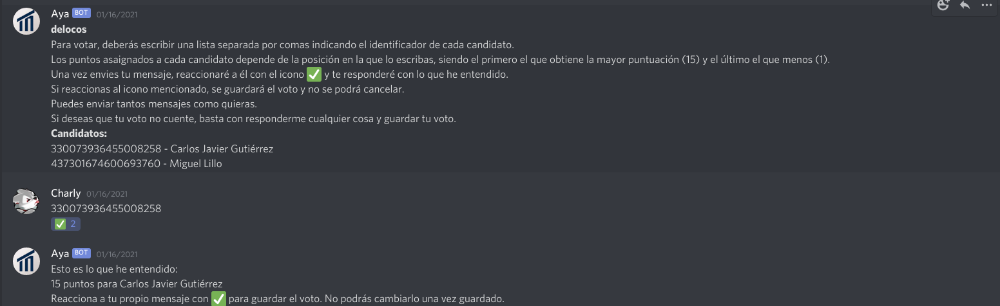

<h1 align="center">
  <br>
  <a href=""></a>
  <br>
  Aya
  <br>
</h1>

<h4 align="center">Discord bot developed for Board voting of the <a href="https://www.uma.es/etsi-informatica/info/126304/consejo-de-estudiantes/" target="_blank">Consejo de Informática de UMA</a> using <a href="https://github.com/discord-net/Discord.Net">Discord.Net</a>.</h4>

<p align="center">
  
  
  
  
</p>

<p align="center">
  <a href="#features">Features</a> •
  <a href="#installation">Installation</a> •
  <a href="#configuration">Configuration</a> •
  <a href="#states">States</a> •
  <a href="#roles">Roles</a> •
  <a href="#license">License</a> •
  <a href="#documentation">Documentation</a>
</p>


## Features

* Allows voting for up to 15 candidates, assigning each one a unique score from 1 to 15.
* Administrator role
  - In charge of handling the voting
* Voter role
  - They may stand as a candidate and vote
* Multi platform
  - Windows, macOS and Linux.

## Installation

To clone and run the bot you will need [Git](https://git-scm.com) and [.NET Core 3.1](https://docs.microsoft.com/es-es/dotnet/core/install/windows?tabs=netcore31) installed.

You can do it by running the following commands in a terminal:
```sh
# Clone this repository
git clone https://github.com/GDUMA/Aya

# Go to the project folder
cd Aya

# Install dependencies
dotnet restore

# Run the bot
dotnet run
```

> It is also possible to run the bot from your IDE if it supports development in .NET

To generate an executable we recommend following [.NET Core documentation](https://docs.microsoft.com/es-es/dotnet/core/deploying/deploy-with-cli) where the different ways of doing it are explained.

## Configuration
In the first run, the `config.json` file will be created, where the bot's token will have to be modified.

This is the default content:

```json
{
  "Token": "your-token"
}
```
To obtain your token you must first have a Discord application, which can be created in the [Discord developer portal](https://discord.com/developers/). The token is found in the _Bot_ section within the application configuration.

## States
The voting has several defined statuses that allow or not the execution of certain actions by the users. Most statuses can be controlled by the moderator:

- **Waiting**: The vote has just been created, it only shows the title and a description. Waiting for the moderator to start.
- **Registering**: Members with the role of _voter_ can present themselves as a candidate by reacting with 📝. They can cancel if they delete the reaction. Wait for the moderator to advance status.
- **SendingMessages**: The bot starts sending private messages to all _voters_ with an interval of 0.8 seconds. At the same time the bot will start reading private messages in case someone starts voting. It will advance to the next state automatically once messages are sent.
- **Voting**: In this state the number of voters who have voted is shown and it is when it is waited for the voting to finish. The moderator is the one who advances to the next state.
- **ProcessingResults**: It literally does nothing. The moderator has to advance to the next state.
- **Finished**: The voting is over and it will show the results sorted by score.

## Roles
He will only interact with users who have the moderator and voter roles explained below.
The ID of the roles is defined in [`Constants.cs`](src/Constants.cs).
To get the ID of a role in Discord, mention the role by adding a backslash at the beginning,`\@rol`. This will write a message that will display the role ID following the format `<@&ROL_ID>`, from where the role ID can be copied.
### Moderator
He is in charge of handling the vote. You can start voting with the command `newpoll <título>` and advance the states described above reacting with ➡️, as indicated in the file `Constants.cs`

### Voter
Users with this role will be able to vote and stand for candidate. To stand as a candidate, you must react with 📝 to the vote during the _Registering_ state. You can retract your cadidatura eliminating the reaction while you are still in the same state.
When you move to the next state, _SendingMessages_, you will receive instructions and can begin voting.
As indicated in this message, the vote is only saved when you react with ✅.


## License
[MIT](LICENSE)

## Documentation
[Spanish version](README-ES.md)
