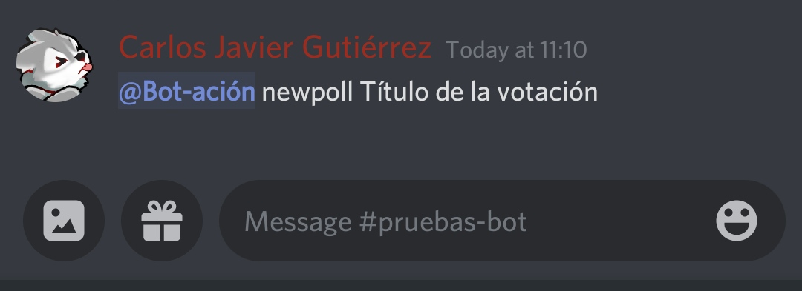
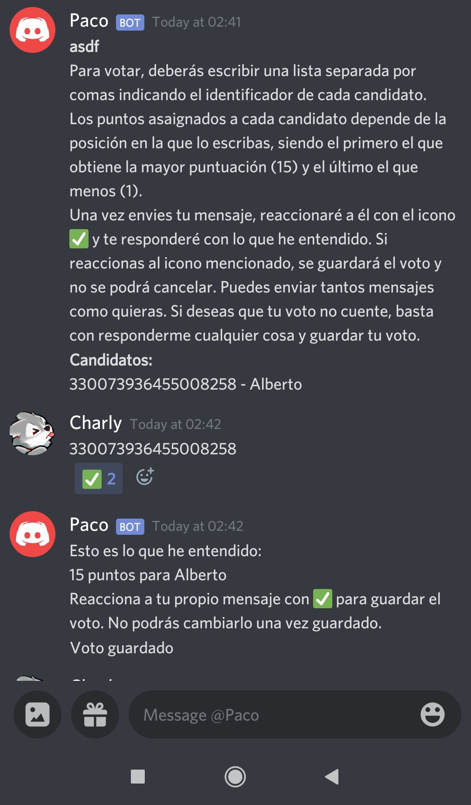

# Aya
Bot de Discord para gestionar votaciones ponderadas

## Requisitos
- [.Net Core 3.1](https://docs.microsoft.com/es-es/dotnet/core/install/windows?tabs=netcore31)

## Ejecución
```cmd
git clone https://github.com/ConsejoInfUMA/Aya
cd Aya
dotnet run
```

## Configuración
En la primera ejecución se creará el archivo `config.json`, donde habrá que modificar el token.
El token se puede encontrar en la página para desarrolladores de Discord.

## Roles
El bot solo responderá a los usuarios con ciertos roles, explicados a continuación.
Actualmente se pueden modificar los roles en el archivo `Constants.cs`.

### ModRol
Puede iniciar la votación con el comando `newpoll título`


Puede controlar el estado de la votación reaccionando con ➡️, tal y como se indica en el archivo `Constants.cs`

### VoterRol
Es el votante y candidato en potencia. Puede presentarse como candidato reaccionando con 📝 durante el estado _Registering_ (Registro de candidatos) y podrá retirar su candidatura eliminando la reacción mientras se siga en el mismo estado.
Cuando se pasa al siguiente estado, _SendingMessages_, los votantes recibirán un mensaje con las instrucciones para votar. Los mensajes irán llegando con un retardo de 1 segundo entre cada votante.
Tal y como se indica en dicho mensaje, el voto solo se guarda cuando se reacciona con ✅.

